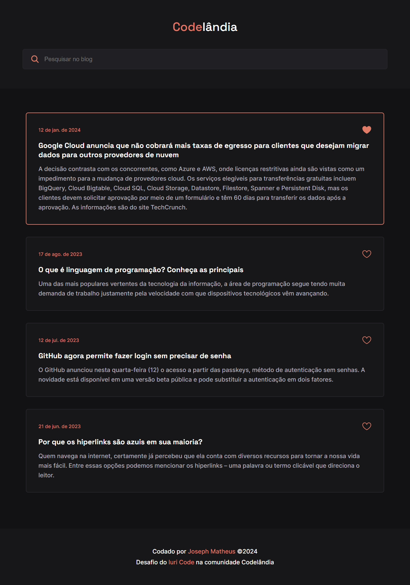

# Blog Codelândia

Este projeto faz parte do **[Desafios Frontend](https://github.com/iuricode/desafios-frontend)🔗**, que por sua vez é um conjunto de desafios desenvolvido pela comunidade **[Codelândia no Discord](https://discord.gg/uHWE7QbXnp)🔗**. O propósito dessa comunidade é ajudar as pessoas a praticarem seus conhecimentos em desenvolvimento frontend.

Este repositório é a minha solução para o Desafio 1 - Blog Codelândia

## 🖼 Screenshot



## 🛠 Tecnologias Utilizadas

- [Vite](https://vitejs.dev/)
- [React](https://reactjs.org/)
- [React Icons](https://react-icons.github.io/react-icons/)
- [Styled Components](https://styled-components.com/)

## 🚀 Instalação

Certifique-se de ter o Node.js instalado em sua máquina.

### 1. Clone o repositório

```bash
git clone https://github.com/josephmatheus/desafio-blog-codelandia.git
```

### 2. Navegue até o diretório do projeto

```bash
cd desafio-blog-codelandia
```

### 3. Instale as dependências

```bash
npm install
```

### 4. Inicie o ambiente de desenvolvimento

```bash
npm run dev
```

Isso iniciará o servidor de desenvolvimento em **<http://localhost:5173/>**
v>

## 📝 Licença

Esse projeto está sob licença. Veja o arquivo **[LICENSE](./LICENSE)** para mais detalhes.
